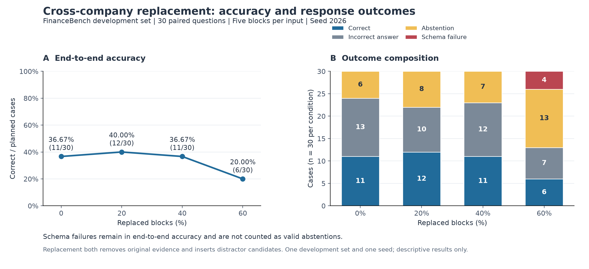

# Noisy RAG Evaluation

A small, auditable experiment on financial question answering under cross-company evidence replacement. The project records model requests, response attempts, confirmed review labels and explicitly defined evaluation denominators.

The finalized results below cover one **30-question FinanceBench development-set experiment**, evaluated at four replacement levels. This is an evaluation project, not a production financial assistant or a claim of general robustness.

## 1. What this experiment evaluates

- Answer correctness when parts of the original retrieved context are replaced.
- Citation support and narrowly defined source hallucination.
- Valid abstentions versus output-schema failures.
- Per-question changes that aggregate accuracy can conceal.

The broader project also contains LLM Only and Dense RAG baseline work. Historical baseline outputs are retained separately. They are not substituted for the 0% condition below, and historical hallucination labels require the same rubric before cross-system comparisons are reported.

## 2. Experimental setup

| Item | Recorded setting |
|---|---|
| Evaluation data | 30 FinanceBench development questions |
| Evidence corpus | 615 chunks |
| Input size | Five evidence blocks per case |
| Replacement levels | 0%, 20%, 40%, 60%: replace 0, 1, 2 or 3 blocks |
| Cases | The same 30 questions at every level; 120 cases total |
| Replacement seed | 2026 |
| Plan | `cross_company_replace_v1` |
| Model | `deepseek-v4-flash` |
| Prompt version | `qa_protocol_v1` |
| Generation | `temperature=0`, `max_tokens=600`, thinking disabled |
| Retry policy | At most three attempts per case; SDK internal retries disabled |
| Final formal-run status | 116 schema-valid outputs, 4 schema failures, 130 attempts |

The experiment reuses frozen original Top-5 contexts and a fixed replacement plan; it does not retrieve or resample between conditions. Replacement candidates come from other companies and are approximately length-matched under the corpus token-count measure. Cross-company selection is a heuristic, not proof that every candidate is semantically irrelevant.

The model receives the company, question and evidence blocks. Gold answers, noise-level annotations and review labels are not sent as model inputs. Incorrect answers and citation errors do not trigger retries merely because they are incorrect. Request/schema failures are logged under the recorded retry policy.

## 3. Results



Each condition contains 30 planned cases. Schema failures remain in end-to-end accuracy with a score of zero.

| Replaced blocks | Correct / all | End-to-end accuracy | Clean accuracy | Abstentions / all | Schema failures / all | Citation support / applicable |
|---|---:|---:|---:|---:|---:|---:|
| 0% | 11/30 | 36.67% | 11/29 = 37.93% | 6/30 | 0/30 | 11/25 = 44.00% |
| 20% | 12/30 | 40.00% | 12/29 = 41.38% | 8/30 | 0/30 | 11/23 = 47.83% |
| 40% | 11/30 | 36.67% | 11/29 = 37.93% | 7/30 | 0/30 | 8/24 = 33.33% |
| 60% | 6/30 | 20.00% | 6/29 = 20.69% | 13/30 | 4/30 | 3/14 = 21.43% |

### Main observations

- End-to-end accuracy changed from 36.67% at 0% replacement to 20.00% at 60%, a decrease of **16.67 percentage points** in this run.
- The pattern was **not monotonic**. The 20% condition had one more correct answer than 0%; this does not establish a general benefit from added noise.
- At 40%, accuracy equaled the 0% result, but **four questions changed from correct to incorrect and four from incorrect to correct**.
- At 60%, seven questions changed from correct to incorrect and two from incorrect to correct. The condition also had 13 valid abstentions and four schema failures; these must not be merged into one refusal category.

For paired transitions, “incorrect” includes wrong/incomplete answers, valid abstentions and schema failures. See the [detailed English results note](docs/noise_results_en.md) for the full interpretation and figure caption.

## 4. Evaluation rules

- **End-to-end accuracy:** correct answers divided by all planned cases.
- **Valid-output accuracy:** correct answers divided by schema-valid outputs. For example, 60% replacement gives 6/26 = 23.08%; this is not the end-to-end rate of 6/30 = 20.00%.
- **Answered accuracy:** correct non-abstentions divided by valid non-abstentions.
- **Abstention rate in the results table:** valid abstentions divided by all planned cases. Schema failures are not valid abstentions.
- **Citation support:** support-correct labels divided by nonblank, applicable support labels. Some abstentions contain substantive claims that still require support, so this denominator can exceed the non-abstention count. The applicable set changes between conditions.
- **Source hallucination:** invented or falsely attributed source content. Insufficient citation support, arithmetic mistakes and explicitly disclosed assumptions alone do not qualify. Schema failures have no hallucination label; they are not automatically hallucination-free.
- **Clean subset:** exclude only `financebench_id_00283` in all four conditions, leaving 29 questions per level. Other disputes and their notes remain in the dataset.

`review_complete=1` records confirmation of the stored labels, not answer correctness or reviewer identity. Metrics are calculated from these labels; the calculation and plotting scripts do not independently rejudge answers. Workbook evidence excerpts are for display. The preserved formal-run records contain the exact original inputs.

## 5. Relevant files and directories

Paths below are relative to the project root. This is a map of relevant files, not an exhaustive repository listing. The `docs` files are presentation copies; retain their source output directories unchanged.

| Path | Purpose |
|---|---|
| `README.md` | Project overview, results and reproduction instructions |
| `docs/noise_results_en.md` | Detailed results note copied from the plotting output |
| `docs/assets/noise_main_results.png` | Stable figure path used by this README |
| `src/prepare_irrelevant_noise.py` | Build or verify the fixed replacement plan |
| `src/run_noise_audited.py` | Run the frozen cases with request/attempt logging |
| `src/test_noise_audited.py` | Noise-runner tests |
| `src/qa_audit_runtime.py`, `src/run_qa_audited.py`, `src/experiment_protocol.py` | Shared runtime, rendering and protocol dependencies |
| `src/calculate_noise_metrics.py` | Validate the confirmed review and calculate metrics |
| `src/plot_noise_results.py` | Validate metric files and generate figures/results text |
| `data/processed/dev_30.jsonl` | Fixed development questions |
| `data/processed/evidence_chunk_corpus.jsonl` | Evidence chunk corpus |
| `results/raw_outputs/dense_rag_dev.jsonl` | Original Dense RAG contexts used by the plan builder |
| `data/noise_experiments/cross_company_replace_v1/` | Frozen replacement inputs, order and audit metadata |
| `results/noise_runs/cross_company_replace_v1_20260901T143232Z_62caa52d/` | Preserved formal run and its frozen-plan copy |
| `results/metrics/noise_formal_manual_review.xlsx` | Confirmed review workbook |
| `results/metrics/noise_formal_final/run_.../` | Versioned metric exports and manifest |
| `results/figures/noise_formal/run_.../` | Versioned figures, results note and manifest |

The formal-run directory contains `requests.jsonl`, `attempts.jsonl`, `results.jsonl`, `run_manifest.json`, `run_summary.json` and `frozen_plan/`. Keep these together.

## 6. Reproduce the analysis without model calls

The following commands use **Windows Command Prompt / Anaconda Prompt**, from the project root. They assume the preserved input files and project scripts above are already present; they are not a fresh-clone data installation procedure.

```bat
conda activate noisy-rag
cd /d D:\Projects\noisy-rag-eval
```

### A. Check the confirmed review and its source run

```bat
python src\calculate_noise_metrics.py --check-only
```

This requires Python 3.9+ and only the Python standard library. Defaults point to the review workbook and formal-run directory listed above. It validates the 120 confirmed rows and their source records without writing outputs or calling a model.

### B. Regenerate the formal metrics

```bat
python src\calculate_noise_metrics.py
```

Each invocation writes a **new** directory under `results\metrics\noise_formal_final`. It does not overwrite previous metrics. The seven exported files are:

- `noise_review_labels.csv`
- `noise_by_level.csv`
- `noise_by_type.csv`
- `noise_distributions.csv`
- `noise_paired_vs_zero.csv`
- `noise_metrics.json`
- `manifest.json`

The manifest records source hashes, metric definitions and completion. Do not edit the generated metric files in place.

### C. Generate the English figure and results note

The recorded completed metric directory for this README is:

```bat
python src\plot_noise_results.py --metrics-dir "results\metrics\noise_formal_final\run_20260902T080300_588268Z_eed54c8d"
```

If step B created a new metric export, replace only the directory argument with the exact `Saved 7 files to:` path printed by that run. Do not mix files from different metric directories.

Plotting requires `matplotlib`. If it is missing, install it in the active analysis environment:

```bat
python -m pip install matplotlib
```

Plotting writes a new directory under `results\figures\noise_formal` containing:

- `noise_main_results.png`
- `noise_main_results.svg`
- `noise_results_en.md`
- `figures_manifest.json`

For README display, **copy**, rather than move, `noise_main_results.png` to `docs/assets/` and `noise_results_en.md` to `docs/`. Retain the generated directory and its manifest as the source record. These steps do not call a model API.

## 7. Optional runner checks and new generation

These checks are separate from the offline metrics workflow. They require the original project dependencies, source files and frozen plan. The runner checks frozen source-code hashes and input consistency; do not bypass a mismatch to force an old experiment to run.

```bat
python src\test_noise_audited.py
python src\prepare_irrelevant_noise.py --check-only
python src\run_noise_audited.py --check-only
```

The test suite uses mocked responses rather than paid model calls. The check-only commands validate the existing plan and request construction without generating model answers.

**New generation is optional, costs money and is not needed to reproduce the results above.** With the recorded environment, configured `LLM_API_KEY`, `LLM_BASE_URL` and `LLM_MODEL`, these commands start separate runs:

```bat
python src\run_noise_audited.py --execute --limit-questions 2
python src\run_noise_audited.py --execute --limit-questions 30
```

The first selects eight cases; the second selects all 120. They are independent runs, not a smoke-test resume sequence. Each can use up to three attempts per case. New outputs require their own review and must not replace the preserved formal run. Even `temperature=0` does not guarantee identical future hosted-model responses.

Full generation depends on the original project environment and input preparation; the minimal offline dependencies above are not a complete generation environment specification. Consult the preserved run manifest for the recorded settings and dependency information.

## 8. Limitations and sharing

- This is a small development-set study with one replacement seed. The 120 cases are repeated conditions on 30 questions, not 120 independent questions.
- Replacement both removes original evidence and inserts distractor candidates. Its effect cannot be attributed to pure distraction alone.
- Page-level gold hits do not guarantee that a supplied chunk contains sufficient evidence.
- The small curated corpus and benchmark-derived evidence setting do not represent unrestricted full-document or web retrieval.
- Annotation disputes are retained explicitly. Confirmation does not resolve all ambiguity, and no inter-reviewer agreement estimate is claimed.
- The reported differences are descriptive; no statistical-significance or universal-robustness claim is made.
- Preserve the FinanceBench attribution and check applicable dataset/document licenses before redistributing questions, evidence or outputs. No redistribution license is asserted here.
- Never commit `.env`, real API keys or credentials. Review source logs for sensitive information and local-path metadata before public sharing; preserve an unchanged private archive.

This experiment provides an auditable evaluation workflow and a bounded set of observed failure modes. Additional noise types, seeds, held-out questions and mitigation methods are possible future extensions, not completed features of the results above.
